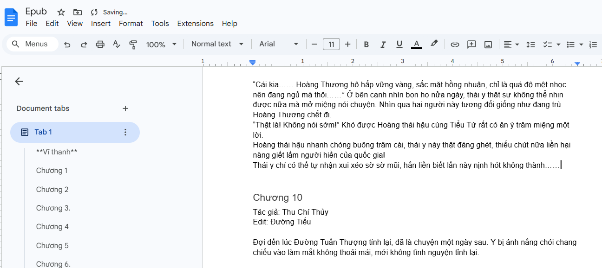

## Web Scrapping and EPUB format conversion workflow with N8N

## Input:

```
https://blog-website-url.com/
```
## Pipeline process

1. First, the process get the HTML content from website from HTTP request

2. Extract the chapters links from the website HTML

3. Get the title and content of blog chapters

5. Using AI agent to style the content to proper form

6. Update into Google Docs the styled content, ready to be converted to EPUB form


## Result:


